<!--
**glazec/glazec** is a ✨ _special_ ✨ repository because its `README.md` (this file) appears on your GitHub profile.

Here are some ideas to get you started:

- 🔭 I’m currently working on ...
- 🌱 I’m currently learning ...
- 👯 I’m looking to collaborate on ...
- 🤔 I’m looking for help with ...
- 💬 Ask me about ...
- 📫 How to reach me: ...
- 😄 Pronouns: ...
- ⚡ Fun fact: ...
-->
### 
<h2 align="center">👋 Hello! I'm Glazec.</h2>

  <a href="https://www.inevitable.tech">
  Blog · 
  </a>
  <a href="https://twitter.com/cruz_lyp">
  Twitter
  </a>

 
 

<!--
<table style="width:100%">
  <tr>
    <th></th>
    <th></th>
  </tr>    
</table>

  <th><th>
-->

